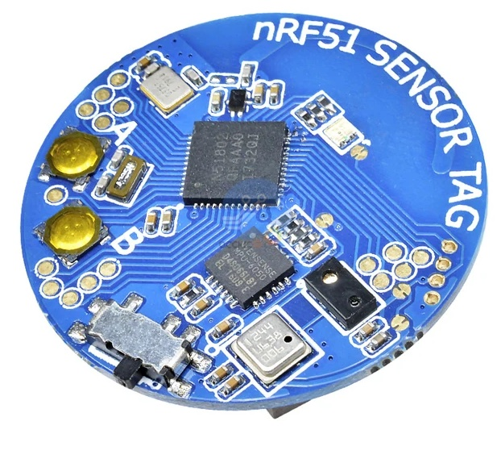
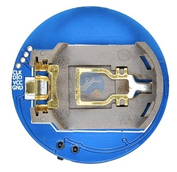

# Head Impact Detector with MPU-6050

This project uses an MPU-6050 sensor to measure the acceleration experienced during an impact and assess the risk of head injuries.

## Motivation

Head injuries can occur during various activities, such as sports or automotive accidents. The severity of a head injury depends on multiple factors, including the person's age, health, and the specific circumstances of the impact. The risk of head injury can be estimated using the following general guidelines:

- 50 g-force or less: Typically not associated with significant head injuries
- 50 to 100 g-force: Risk of mild to moderate head injuries
- 100+ g-force: High risk of severe head injuries

This project aims to provide a simple and affordable way to measure and monitor the g-forces experienced during an impact, enabling users to assess the risk of head injuries.

## Features

- Measures acceleration in X, Y, and Z axes using an MPU-6050 sensor
- Calculates the resultant vector force (magnitude of acceleration)
- Displays the acceleration values and resultant vector force in g-force units

## Development Environment

- PlatformIO with Visual Studio Code

## Getting Started

1. Install [Visual Studio Code](https://code.visualstudio.com/).
2. Install [PlatformIO IDE extension](https://marketplace.visualstudio.com/items?itemName=platformio.platformio-ide) for Visual Studio Code.
3. Clone or download this repository.
4. Open the project folder in Visual Studio Code.
5. Connect the MPU-6050 sensor to your development board according to the provided wiring instructions.
6. Build and upload the code to your development board.
7. Open the serial monitor to view the acceleration values and resultant vector force.

## Example tag

Sample image of a tag that can be purchased.
| Front | Back |
| ----- | ----- |
|  |  It is good to check for programming pins before you buy one. |

## License

This project is licensed under the MIT License - see the [LICENSE](LICENSE) file for details.
